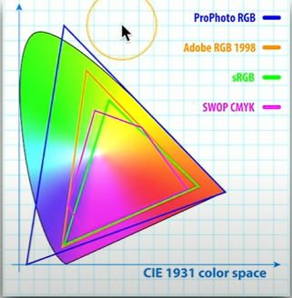
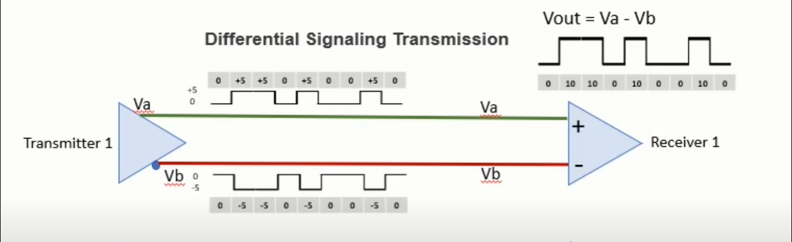
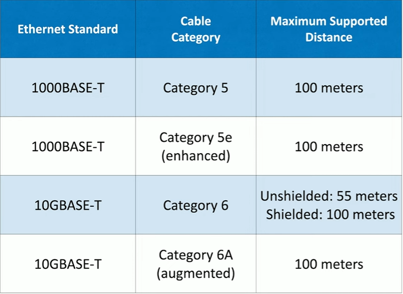
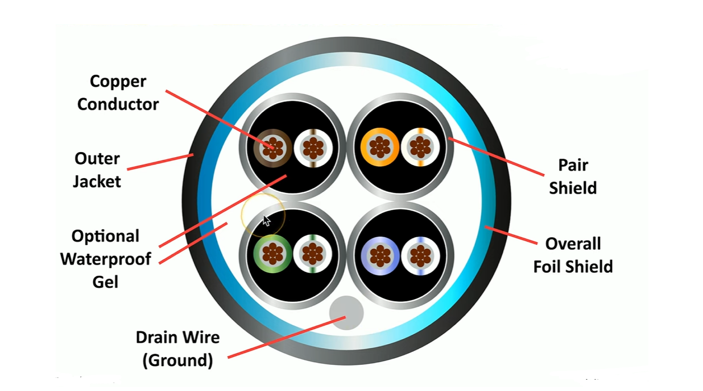
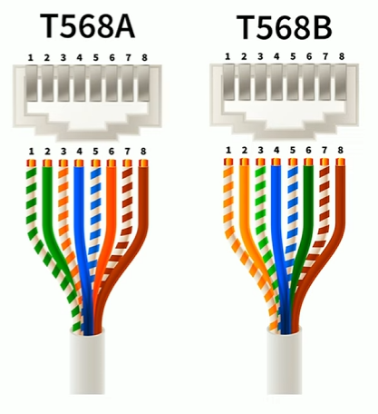
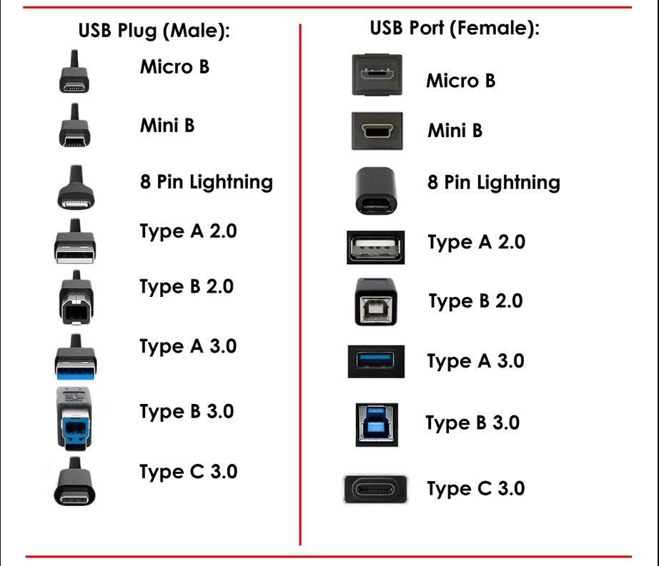
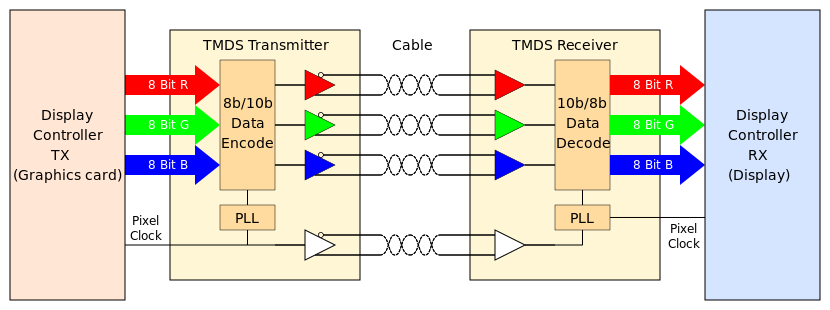
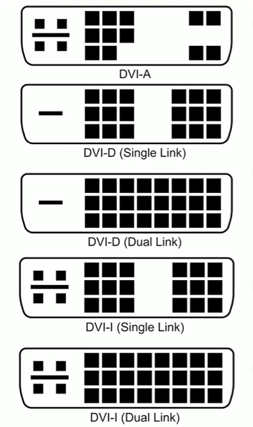

# 3.1.1 Display Types

## LCD (Liquid Crystal Display)
LCD is a type of display that uses a combination of a light source (LEDs or florescent lamp, also called a backlight), polarizing filter, electrodes, liquid crystals, electrodes, a color filter, another polarizing filter, then the display surface in that order to give the user a display, the backlight in the LCD screen allows the user to see the screen by flashing lights in their eyes and the other layers after the lights manipulates said light to give different colors, brightness, and such. LCD displays are lightweight and relatively low power and cheap but come with the downside that it is very hard to get a black color with LCDs (since the polaroids aren't able to filter light flawlessly) and depends alot on the backlights which are difficult to replace, these backlights also add more cost, draw more power and waste more power (power spent on electricity that is filtered out by the first polaroid), and causes the display to be bigger. Another downside is that the brightness of the screen is also dependent on the angle you are looking at the screen from, this is because of the 2 polaroids which we will talk about later. A more detailed explanation is that the light that comes from the backlight has to go through the previously mentioned 2 polarizers, these 2 polarizers are perpendicular to eachother meaning light able to pass through one polarizer isn't able to pass through the other (more specifically one polaroid only lets through light of a specific orientation and the other only lets through light of a different orientation perpendicular to the previous filter, because of this only light of a specific orientation is able to get through the screen and to youre eyes which is the cause of the previous mentioned disadvantage), the method to get this light past the 2 polarizing filters is the liquid crystals inbetween which will convert the light to allow it to go past the next polarizing filter, this liquid crystal controls the brightness, this is done by applying an electromagnetic field to 2 electrode layers which sit before and after the liquid crystals which will control the orientation of the liquid crystals and hence how much light is converted. Once the light passes through the last polaroid it will then hit a green, red, or blue filter which makes up a single pixel to give an rgb color value.

## LCD Technologies
There are different types of LCD screens that have evolved and changed over the years. One type of LCD screen is a TN (Twisted Nematic) LCD screen, the TN LCD screen is the original LCD technology and offers fast response time but comes at the downside of poor viewing angles. Another type is IPS (In Plane Switching) LCD screen which offers great diversity in colors but is more expensive. The last type to talk about is the VA (Vertical Alignment) LCD which is kinda a compromise between the previously 2 mentioned types.

## OLED (Organic Light Emitting Diode)
OLED is a type of display that uses organic materials that when you give power via an electric current emits light, and because OLED emits light this way there is obviously no need for backlights and the disadvantages associated with them causing also a much more thinner and lighter display aswell. These displays tend to provide very accurate color representations but also come at the disadvantage that they are expensive aswell. OLEDs kinda work in a similar way to LCDs in the fact that 2 layers of electrodes will be situated in front and behind the organic material to give said material current so it can emit light, the amount of current you give a section of the organic material controls how much light said organic material emits i assume, then said light passes through one of the rgb filters again just like in LCD which then makes up a pixel of a screen.

## Mini LED (Mini Light Emitting Diode)
Mini LED screens are just LCD screens except with much smaller and much more (and as a result finer grain grain control) LEDs to implement the backlight, this results in being able to turn off pretty much all light in specific sections of a screen also resulting in much better black colors being achieveable in mini LED screens. Mini LED screens are also able to achieve much better color representation than LCD screens aswell.

## Touchscreen
Touchscreens as the names suggests is a screen that you are able to touch to interact with said device. Touchscreens are implemented by a digitizer which responds to touches and converts where you touched into coordinates which can then be communicated to the device. These digitizers can also recognize input methods other than your hand aswell, something like a stylus for example can be used for input aswell.

## Backlight and Inverter
Backlights as of more recent are being implemented with LEDs, but in the past were implemented with florescent lamps, these 2 methods requires different types of current though to emit light, the former requires DC while the latter requires AC, this becomes a problem for the later florescent lamps since computers and more specifically laptops for this context uses DC, and since the laptop and the laptop screen uses the same power source a converter is needed to convert that DC current to AC current.

# 3.1.2 Display Attributes

## Pixel Density
Pixel density specifies as the name suggests the density of pixels, more specifically it specifies the amount of pixels there are in a inch for example, the higher this number the better since your screen will be able to support higher resolutions and higher quality pictures (looks more sharp and clear). Calculations for pixel density is usually down by just taking the horizontal length and using that to divide the horizontal pixels.

## Refresh Rate
Refresh rate describes the amount of times per second the display is being updated, or the amount of frames being displayed per second, a higher refresh rate will mean a cleaner and smooth video will be shown. Refresh rate can bottleneck your fps (having 144 fps and 60 hz monitor will still result in only 60 frames per second being shown), but that doesn't necessarly mean having higher fps than refresh rate is useless since when your monitor refresh does occur it will show the most recent frame generated, this can result in less delay between your inputs and the frames being shown. There exists options to completely sync the refresh rate with fps aswell (that being vsync). Refresh rate is usually important for things like gaming for example, for things like watching videos refresh rate is considered less important.

## Screen Resolution
Screen Resolution refers to the amount of pixels there are horizontally and vertically on the display, this is different than pixel density which refers to the amount of pixels there are in a certain unit of distance. The more pixels means a sharper image, but how sharp this image is also depends on how far you are from the screen since if the screen has a high resolution but a garbage pixel density the screen up close will not look sharp at all but from a distance it will. The ratio for the resolution can vary and this is usually represented as a ratio to show the number of horizontal pixels there are in relation to the vertical pixels (example is 16:9 and 16:10).

## Color Gamut
Color gamut refers to the range of colors a screen is able to display and how vibrant they are. This is usually represented by showing the range of colors a human eye can see and layering ontop of it the range of colors that a screen can show...

The above image shows in the background the range of colors the human eye can see and overlayed over it a bunch of color gamut standards showing the range of colors a display can show, the color gamut standards are named in the legend shown in the image. Inside the specs of a display usually one of the color gamut standards will be mentioned to convey they range of colors that a display can show, an example will be the specs saying they can show 100% sRGB, 95% sRGB, etc. This might be obvious but it is also worth a mention, a higher and better color gamut will result in a higher price so buying a display with a high color gamut is only really worth it if you think it is important or necessary to you.

# 3.2.1 Network Cables
Something to note is that the way a changing magnetic field induces current is that the changing magnetic field will create an electric field and if a conductor is present where the electric field is current will be created, just something to note.

## Twisted Pair Copper Cabling
The goal of twisted wire is to create a current of electricity which will encode data, but at the same time prevent interference from the outside world from interfering with this current and possibly messing up the encoding. This is done by twisting 2 copper cables together, but more specifically what happens when current needs to be put on a wire to transmit data current is put on the other wire in the opposite direction to produce a electromagnetic field that is the exact opposite to the one produced by the other wire it is twisted with and will hence cancel out (right thumb rule) so it allows to have current traveling bidirectionally without the electromagnetic field induced by them interfering with eachother, then to determine the data modulated on the electric current the voltage of one wire is subtracted from the voltage of the other wire to achieve an enhanced signal... 

And if outside electromagnetic fields try to interfere with the current inside of the wires this is another problem that is fixed by the twisting of the copper cables. What happens is the change in magntic fields will affect the 2 wires at the same time but at different parts of the 2 wires (but close enough so that it occurs at the same voltage influx and corresponding deflux on the 2 wires), the then previously mentioned subtraction of voltage will then be able to cancel out the increased voltages in the 2 copper wires which will allow so that no interference of the data in the copper wire can occur. Also note that in CAT cables there are 4 pairs of twisted wires, each twisted at a different rate (research why?).

## Twisted Copper Cable Categories
Twisted copper cables have different categories and different standards they abide to to communicate data faster, these standards are specified in the IEEE 802.3 standards for ethernet and different categories of twisted copper cables supports different versions of this standard. The categories of twisted copper cables use the naming convention of CAT where CAT stands for category and with a number after it to represent what category and possibly another letter after that to represent a new version of a cable of that category, a higher number usually means a more recent standard of IEEE 802.3 is being used. Examples are CAT5, CAT5E, CAT6, CAT6A are the more recent ones...

Some really good videos that helped increase my understanding...
- https://youtu.be/RVzM-b3okH0
- https://youtu.be/P7WfY9P2uNY

## Coaxial Cable
Coaxial cable is also another cable that can be used to transmit data using radio waves that travel only on the cable, the name Coaxial comes from the fact that the inner and outer conductors of the cable shares the same geometric axis, co meaning together and axial refering to the axis, coaxial cable is made up of 4 layers the inner most layer is a copper wire which is used to carry current which will help produce the radio wave which will encode the data, the next layer is an insulation layer called the dielectric so that current can't travel from the inner copper wire to the copper mesh shield (mentioned next), the layer after that is a cooper mesh layer usually called a shield which acts as a layer to protect the inner copper wire from outside noise and prevent the electromagnetic field emitted by the current of the copper wire from interferring with the outside (the induced current the outer shield gets from this is transfered to the ground, going from the shield, to the outside of the plugin for the cord, down to the wall plugin, and to the ground im pretty sure is how it works) and will also carry current to help produce the radio wave aswell, and the last layer is another insulator who's main purpose is to protect the inners of the cable from outside elements. Coaxial cables as of today are mostly used for cable television, but in the past they were used for a multitude of things, an example being RCA cables which were the old way for giving video input before HDMI was a thing (Note this is not complete and alot of this data might be incorrect since it is difficult to get a full picture without a complete understanding of physics, requires more reasearch).

## UTP and STP (Unshielded and Shielded Twisted Pair)
UTP and STP (twisted copper wire) is just another layer between the actual twisted copper wire and the outer shell of the ethernet cable and is just meant to help with interference (while what we mentioned in the twisted pair copper cabling section helps with interference it does not prevent it completely and there are probably edge cases where interference can cause problems without this shielding), without the shield obviously magnetic waves are free to interfere with the current inside the copper wires, but with shielding this can help prevent electromagnetic fields from interferring with said current inside the copper wires. Shielding can also be implemented by shielding each individual pair of wires and another thing to note is that if you add shielding the induced current on the shielding that comes from protecting the inner wires needs to be terminated in some way (aka connected to ground). Note that on the outside of the twisted copper cable it will tell you what shielding is being used via abbreviations, a U means unshielded, S means braided shielding, and a F means foil shielding. The naming will be formated usually in the for <overall shield>/<pair shields>TP where overall shield means shield around all twisted pairs and pair shields mean shields around individual pairs.

## Direct Burial STP
Sometimes it is more convenient to bury ethernet cables in the ground to get ethernet from one building to another and there are specific cable designed for this that provide protection against things like water for example. Putting cables in the ground also provides grounding and potentially protects against signal interference (assuming dirt reflects or absorbs EMR).

## No Plenum and Plenum
Inside of a building when you look at the ceiling what youre looking at is probably a drop ceiling and there are additional things between this said ceiling and the actual roof, things like ventalation and potentially electrical wires. One of these drop ceilings is referred to have plenum if there is no forced air circulation and air is allowed to roam in open space while having forced air circulation in the drop ceiling is referred to have no plenum. In the case of plenum drop ceilings it makes it very easy for toxic fumes and smoke to move around said ceiling which can potentially affect the electrical wiring and potentially make the problem worse, this is where plenum cables come into play which are specifically designed to withstand fires (fire-rated) and probably other conditions, the disadvantage of using these cables is that they are very stiff, but they are still important to use in plenum environments.

# 3.2.2 568A and 568B Colors

## Structured Cabling Standards
There are standards related to cabling to provide consistency, these standards for cabling are defined by ISO/IEC 11801 internationally, and in the US there is the TIA (Telecommunications Industry Association) which defines cabling standards for the US, their standards are defined in ANSI/TIA-568, these standards more specifically are for the installation of cables inside of commercial buildings. These standards are usually referred to for wire to pin connections and specifically the topic of this section, what copper wires is attached to what RJ45 pin for twisted pair wires, there are 2 standards for this called T568A and T568B.

## T568A and T568B
These standards are needed in this context obviously to make trouble shooting more easier and provide consistency. T568A and T568B like mentioned before are just 2 different ways to attach the colored copper wires to pins, the 2 standards are only slightly different from eachother. These standards should NOT be mixed with eachother, mixing T568A with T568B (meaning having T568A on one end and T568B on the other) will cause incorrect behavior. Most organizations will only usually stick to one standard with apparently T568B being the most common of the 2.

These standards are important to remember especially if youre doing crimping for a network. The 2 standards like mentioned before are only slightly different with only difference between pins 1,2,3, and 6 so these pins are the only differences you have to memorize to remember both standards (and ontop of that the common colors for pins for both standards, aka 4,5,7, and 8).

# 3.2.2 Optical Fiber

## Fiber Communication
Fiber communication is the communication of data using visible light, since radio waves are of a completely different frequency than visible light on the EMR spectrum radio waves cannot interfere with fiber optic communication and is very difficult to tap and to monitor since the visible light is completely encapsulated inside of the wire, bouncing and reflecting off the middle layer of the wire, fiber optics are also ideal for long distance travel aswell. Fiber optic cables works by having 3 layers, an inner layer for the light to travelm a middle layer which will reflect the light in the inner layer keeping the light encapulated, and an outer layer to protect the wire from the elements (and to provide something better to grip).

## Types of Fiber
There are usually 2 types of fiber, the first multimode fiber which is meant for short range communication usually up to 2km and usually uses a pretty cheap light source (LEDs for example), it's called multimode fiber because the path the light takes to travel through the cable varies each time, hence multimode. The other type is called single mode fiber and light can travel up to 100km in this type of fiber, compared to multimode fiber this type of fiber uses expensive light sources (usually lasers) and travels through the fiber in a single mode (deterministic), single mode fiber is has also a much more narrower core for light to travel through when compared to multimode fiber.

# 3.2.3 Peripheral Cables

## Parallel vs Serial Communication
Peripheral cables will communicate using either parallel communication or serial communication, serial communication is communication a single bit at a time while parallel communication is communication using multiple bits at a time sychronized across multiple channels. Note that using multiple channels for communication is not equivalent to parallel communication it is only parallel communication if you are synchronizing these channels to send bits at the same time to communicate a symbol at once, using multiple serial channels at once that are out of sync is still considered serial communication.

## Container vs Standard
There is a difference between the actual physical design of a cable and the standard that cable uses (what i like to call the container and the standard). USB 1.0, 2.0. 3.0, 3.2, thunderbolt, RS-232 are all standards for example, while USB A, USB B, USB C, micro USB, mini USB, DE-9, DB-25 are all containers which act as a medium for these standards, these containers only support maybe some of these standards and others only supports a single standard, an example would be serial cables where you see them only using RS-232 standards and an example of a multi-purpose container would be USB C which can run pretty much all versions of USB and also thunderbolt 3.0 aswell (and maybe more).

## USB (Universal Serial Bus)
USB has become the standard connection cable for devices around the world, including printers, storage devices, keyboards, and mice aswell. One of the first versions of USB was USB 1.1 which offered a low speed version of 1.5 Mbit/s and a length of around 3 meters, and a high speed version of 12 Mbit/s and a length of around 5 meters. Then comes USB 2.0 with a speed of 480 Mbit/s and with a length of around 5 meters. Next there was USB 3.0 which provides 5 Gbit/s speeds with a length of around 3 meters (the standard does not specify cable length so length can change, but 3 meters is about the max length you can make the cable without coming at the cost of the previously mentioned throughput). After that there were 2 new versions of USB 3.0 being USB 3.1 and USB 3.2 with each version doubling the throughput from the previous version. There are 2 sides of a USB connection, the host, and the peripheral device, the connection for the host is called the DFP (Downstream-Facing Port) while the connection for the peripheral device is called the UFP (Upstream-Facing Port) which dictates what device is the master and what device is the slave (the only thing i can find that changes with the connection itself whether what device is the master or the slave is the direction of power control, the master will always provide power to the slave device). In a USB system there is only ever 1 host with peripheral devices connected to it, and the amount of peripheral devices connected can be extended by adding a USB hub to connect to the USB host which will have a bunch of DFP ports to connect even more peripheral devices to the main USB host and usually a type A connector will be connected to the host and if your USB cable has 2 USB-C connectors then either side of the cable can act as the host (historically since the type A connector was used for the host and the type B connector was used for the peripheral the side that connects to the host is called the A side of the USB cable and the side that connects to the peripheral is called the B side). Also something to note like the previously mentioned coxial cable (and sometimes present in ethernet cables) there is a shield which is there for the same reasons as the previously mentioned sections. The pins for USB has needed changed from version to version to support the new standard with each newer version kinda being a superset of the previous versions' pins, we first start with the original USB 1.0, 1.1, and 2.0 versions which all needed a pin for power, a pin for power ground (im pretty sure this is to return the electricity back to the other system to complete the circuit, though i'm not sure), and 2 pins for data with the wires connected to these pins being twisted pair to provide the same advantages we mentioned in the previous twisted pair copper section (this means there is only 1 channel for data in this original version of USB, so data travel was directional and you could only communicate in 1 direction at a time) with USB A and USB B being examples of connectors that support this standard. Mini and Micro USB has 5 pins instead of 4 and adds an extra pin whos purpose is an ID pin which communicates what side is the host and what side is the peripheral device to support the USB On-The-Go standard. Then USB 3.0 needed 9 pins and is a superset of the previously mentioned USB 1.0, 1.1, and 2.0 version's required pins, the 5 extra pins adds bidirectional communication now so we have extra communication channels for super fast communication, 2 of those pins are for 1 of the twisted pairs for the extra data channel, and another 2 pins are for the other twisted pair to make for now 3 data channels, the 2 extra channels are only single directional though with one of them being solely for transmitting and the other being used for solely receiving, and the last pin is for another ground connection, more specifically ground for signal return, USB 3.0 was supported by USB A 3.0 and USB B 3.0 and also USB C. USB 3.2 then acted as an update for the USB standard but only for type C, type C adds an extra power pin, another pin for configuration, and a pin for "Sideband use" onto the previous 3.0 pins, but also doubles this and inverts the placement of the pins on the other side of the connector making 24 pins and allowing insertion of the cable in any orientation, USB 3.2 then allows use of all these channels effectively doubling throughput which is why this standard only works on USB C. Communication through these cables requires sychronizing the 2 ends and sending varying voltages to signify either 1s or 0s, one protocol to do this is called NRZI (Non Return Zero Inverted) which says that a 0 is sent on a voltage switch and a 1 is sent if the voltage remains the same, this allows for frequent voltage switches so the 2 ends can sychronize how long it take to send a symbol (aka how long is a cycle).

## USB Connectors
Over the years and subsequent versions USB has had multitudes of connector types, the connector on the USB cable itself is called the male part of the connector, and where said cable is supposed to be connected to is called the female part of the connector. In the below image shows all the connectors of USB over it's iterations...

USB-C has an advantage over all the other connector types considering the fact that USB-C can be plugged in using any orientation and also supports in general alot more protocols and standards when compared to the other connectors, also note that the connector type does not dictate what signals are sent over said USB cable.

## Serial Cables
Before USB we used serial cables, serial cables usually uses the following naming scheme first starting with the letter "D" then after that a letter specifying the connector size, a hyphen, then a number specifying the amount of pins the connector expects (example, DE-9 and DB-25). Serial cables send signals using a standard called RS-232 (Recommended Standard 232) and has been a standard since 1969, use of these cables nowdays is mostly used for legacy equipment and hardware (in the past legacy devices had console interfaces that sometimes used serial cables to connect to it, this can be useful for troubleshooting said device which provides a command prompt to configure the device). Lets go over what each pin of a standard DE-9 connector does using the RS-232 standard (note the DB-25 connector's pins would then be a superset of the DE-9 connectors pins except all the added pins are control signal pins). First pin 1 in a DE-9 connector is the DCD (Data Carrier Detect) pin, this pin is responsible for telephones for checking if a remote connection is up, once a connection is made the signal this pin transmits stays asserted until the connection is cut off. Pin 2 is the RXD pin for receiving data. Pin 3 is the TXD pin for transmitting data. Pin 4 is the DTR pin for receiving a signal from receiver that the receiver is ready. Pin 5 is the GND aka the signal ground in this case which acts as a zero volt reference point. Pin 6 is the DSR pin to send a signal to the transmitter that the receiver is ready to receive signals, this pin always contains a positive voltage from receiver to sender aslong as the receiver is still receiving data. Pin 7 is the RTS pin and is meant to receive signals for hardware flow control. Pin 8 is the CTS pin and is used by the receiver for hardware flow control to signal the transmitter to stop sending messages temporarly is the receiver is being overwhelmed by to much data at once, the receiver always puts a positive voltage on this pin aslong as the receiver wants to receive data, if it doesn't want data it puts no voltage on this line. Pin 9 lastly is the RI is used to signify to the terminal that the phone line is ringing (phone line that is connected to the modem since serial cables was historically used in relation to telephone lines). This might be obvious but for the RS-232 standard to work the TX pin must be connected to the RX pin and vice versa, the DTR pin must be connected to the DSR pin and vice versa, the RTS pin must be connected to the CTS pin and vice versa, and DCD pin must be connected to the DCD pin and the RI pin must be connected to the RI pin. The DCD and RI pins are pretty obsolete for the limited uses of serial cables since these pins were only responsible for sending signals related to when these cables were currently being used for telephones, like mentioned before RI is for sending a signal to the telephone to tell it to ring, and DCD is for checking whether a connection between modems is still present (positive voltage if it is, else no voltage).

## Thunderbolt
Thunderbolt is a highspeed serial connection that provides data and power all on the same cable which makes it very convenient. Thunderbolt 1 provided 2 channels for throughput and 10 Gbit/s of data per channel for 20 Gbit/s total throughput and used a mini displayport connector. Thunderbolt 2 on the other hand is pretty much the same as thunderbolt 1 except combined the 2 channels into a single channel of 20 Gbit/s throughput (via some sort of protocol i assume though i don't know what). Thunderbolt 3 upgraded this even further providing 40 Gbit/s aggregate throughput and also changing the connector type to USB-C. Thunderbolt 4 then added dual support for 4k displays and increased PCIe bandwidth. All thunderbolt versions to implement transferring of video data uses the displayport protocol and to transfer any other data uses PCIe x4. Thunderbolt also supports daisy chaining if you want to display video on multiple monitors and it's more convenient to connect monitors together.

# 3.2.4 Video Cables

## Digital vs Analog Signals

## HDMI (Hight Definition Multimedia Interface)
The HDMI cable is a cable that is able to send both uncompressed audio and video over the same connection and is a cable that an go a distance of about 20m before losing signal and uses 19 pins. HDMI enables hot plugging meaning you don't have to restart the device for HDMI to work, you can just plug one end to your system and the other end to a monitor and it will work. A HDMI cable like mentioned before has a total of 19 pins to support the HDMI standards, the original purpose of these pins to support these standards are as follows. Pins 1-9 are being used for 3 TMDS (Transition-minimized differential signaling) data channels with each data channel using twisted wire which requires 2 positions in the HDMI cable and another position for signal ground for that channel for a total of 3 positions for each data channel (so with 3 data channels we get 9 required positions). Pins 9-12 are for TMDS clock which is responsible for synchronizing the 3 data channels so the 2 devices can tell the baud rate of each channel (how long it takes to transmit a symbol). Pin 13 is used for CEC (Consumers Electronic Channel) which is a channel that is used to send commands and control the display device the HDMI cable is connected to, this is to enable remote controlling of the display device so that you can do things like turn down the volume for example which is an actual command the source device can send to the display device with this channel. Pin 15 and 16 is used for DDC (Display Data Channel) is a channel that is used by the display device to communicate to the source device supported display modes (resolution, aspect ratio, refresh rate, color depth, etc) and for the source device to communicate to the display device changes in display settings (brightness, and contrast for example), the 2 wires connected to these pins are actually not used for twisted wire, instead 1 wire is used to send data while the other is to specify the clock of said data (this is called I²C). Pin 17 is a ground pin for DDC and CEC (and ARC and HEC which is mentioned later) which i assume is for power ground to complete the circuit. Pin 18 is to provide power (it provides +5V of power which is not nearly enough to power a device by itself so you'll still need an external power source, this is used to provide for example some power to the display device when it doesn't have power to communicate things like display settings for example, but again this wire doesn't supply nearly enough power to do something like power on the display, it is also used for hot plug detect aswell). Pin 14 and pin 19 are used for both ARC and HEC, ARC (Audio Return Channel) is just a channel for the display device to send back audio data when the source device is a device that can output audio (this source device can be a audio video receiver which sends video and data to your display device and the display device wants to send back the audio from the HDMI protocol back to the audio video receiver so it can then send it to an audio device (AV receivers act as switches), or the source device can be a sound bar which send HDMI signals from an xbox for example to the display device and receives), HEC (HDMI Ethernet Channel) as in the name is just a method to provide ethernet over HDMI which allows network communication between 2 devices connected using HDMI, together ARC and HEC is called HEAC and can be used at the same time using multiplexing algorithms (Note that pin 19 before HEAC was added in one of the HDMI standards was used for hot plug detect and is still used for hot plug detect to this day, while pin 14 before HEAC was just reserved for future use). Note that we mentioned that 2 pins were used for hot plug detect, when you first plug one end of the cable in that end of the cable immediately puts +5 V onto pin 18 the power cable, once the other end of the cable is plugged in that device receives the +5 V on pin 18 and in response sends a voltage (+5 V aswell im pretty sure) onto pin 19 to signify the other end of the cable is plugged in and this is how hot plug detect works (atleast i'm pretty sure). Lets take a deeper look into how the TMDS data channels work, the TMDS data channels are responsible for sending the image data and also the audio data, the image and audio data are sent in turns with the image data being sent at one turn and the audio data at the other (kinda like Time Division Multiplexing), as mentioned in the name the 3 data channels use differential signaling with twisted copper pair to minigate EMI and also transmit the data over the 3 channels serially, when the video data is being sent RGB values are sent by using each of the channels to send the R, G, and B values. Before the data is actually sent along the twisted pair TMDS first encodes the data that is being sent (every 8 bits is encoded as 10 bits), sends the data to a [buffer](http://hyperphysics.phy-astr.gsu.edu/hbase/Electronic/buffer.html#c2) which goes to another buffer, it then decodes the data (every 10 bits back into the original 8 bits), this is shown in the image below where the triangles are the buffers and the encoders and decoders are appropriately labelled...

The encoding process of TMDS works as follows, in the first stage the 8 bits given as input are either XORed or XNORed with the previous bit of the input (if there are more 1s in the input then XNOR is used, if there are more 0s XOR is used), whichever one of XNOR or XOR is used is encoded in a 9th bit added to the processes 8 input bits. Next in the second stage the 8 input bits that were processed are chosen to be inverted if if there are more 1s than 0s as to decrease the voltage needed to be used and this is encoded in a 10th bit, else nothing is done and this is encoded in a 10th bit aswell. This enoding processes purpose is to help reduce signal degradation, help achieve better clock recover for the receiver, and also reduce electromagnetic interference.

## Passive and Active Adapters
Passive adapters are adapters that just rearrange the connection of pins on one end of the cable to the other (think of cables where the 2 connectors are different, this is a passive adapter, but a passive adapter can be an extra component you plug in on one end of a cable aslong as it doesn't use a computer chipe). Active adapters on the other hand are usually a completely seperate component that you can connect to a cable to adapt from one standard to another that does so with the help of a computer chip, this computer chip can also be used to boots the signal potentaially increasing the range of the cable.

## DisplayPort
DisplayPort is another cable that is able to send both audio and video just like HDMI and sends information for both using a packetized form. This cable is compatible with HDMI and DVI meaning you can take an adapter and be able to convert the information put on this cable into a form that HDMI and DVI understand. DisplayPort cables also sometimes contain a locking mechanism meaning once you plug it in it locks in to the female side of the connection. Lets go over the pins of displayport (also note that all displayport standards use the same amount of pins so this will not change from cable to cable and we will talk about how each of these pins were used historically by each displayport standard), pins 1-12 are all data channel pins with 3 pins being required for each data channel (2 pins for twisted pair for differential signaling, and another pin for ground), these channels are uni-directional going from the source device to the display device. Pin 13 and 14 are used for CONFIG1 and CONFIG2 which is used to detect the presence of adapters, pin 14 can also be used for CEC aswell in the case where HDMI signals are transmitted over the displayport cable. Pin 15-17 is an auxilary channel for the sink device to communicate with the source device and is uni-directional. Pin 18 is for detecting hot plugs where the sink device constantly puts a 3.3V signal onto the pin to signify that the display device is connected to the source device whenever it's connected. Pin 19 and 20 are for return to power and giving power to the sink device respectively, pin 20 is actually a pretty controversal pin since the displayport standard specifies this pin should be left unconnected with a wire since this can potentially cause short circuiting and damage to the connected devices, uncertified distributors of these cables proceeded to so anyways which caused potentially alot of damage to hardware.

## DVI (Digital Visual Interface)
DVI is a single connector type but has multiple connections. There's DVI-A, DVI-D (single link), DVI-D (dual link), DVI-I (single link), and DVI-I (dual link). DVI-D (single link) and DVI-D (dual link) uses digital signals (which is the reason for the D), DVI-A sends analog signals and is backwards compatible with VGA, and DVI-I (single link) and DVI-I (dual link) where the I stands for integrated which means it can send both digital and analog signals. Single link and dual link supports 3.7 Gbps 1920x1200 at 60hz and 7.4 Gbps 2560x1600 at 85hz respectively and DVI does not support audio either so only video is transmitted.

## VGA (Video Graphics Array)
Also called a DE-15 connector and is a connector that is usually in the color blue and is a connector that only sends video. VGA sends analog signals and not digital signals which causes the image to degrade if sent over distances after 5-10 meters.

## USB-C
USB-C can also nowdays be used to send video data aswell along with the power and usb data USB-C is already capable of sending.

# 3.2.5 Storage Cables

## SATA (Serial AT Attachment)
SATA is the cable type to connect HDD and some SSD types to a computer, SATA revision 1.0 offers 1.5 Gbit/s, SATA revision 2.0 offers 3.0 Gbit/s, SATA revision 3.0 offers 6.0 Gbit/s, and SATA revision 3.2 offers 16 Gbit/s with all of these having a cable length of 1 meter. There is also eSATA (external SATA) which supports connecting external drives with a cable that is 2 meters in length. The SATA standard specifies 2 cables, one for data and one for power, the data cable's connector accepts 7 pins while the power cable's connector accepts 15 pins. On your computer the powercable will have one end connected to your power supply and the other to your harddrive, while the data cable will be going from your motherboard to your harddrive to facilitate data flow.

## eSATA (external Serial AT Attachment)
Like mentioned before there is also a version of SATA called eSATA, eSATA and SATA uses pretty much sends the exact same signals over the cable, what is different is the previously mentioned cable length, the connector itself which is slightly different, you cannot plug a eSATA cable into a SATA connector and vice versa and like said in the name eSATA is usually meant for external connections (outside the computer) while SATA is meant for internal connections (inside the computer). You can sometimes find eSATA connections on the back of your motherboard for example.

# 3.2.6 Adapters and Converters

## DVI to HDMI
DVI-D and HDMI are able to be converted to eachother, you can use either a DVI-D to a HDMI cable or simply an adapter with a interface for both of these on different sides. This works because DVI-D and HDMI are electrically compatible with eachother and use digital signals, so you can use a DVI-D and HDMI adapter to connect the 2 without needing any signal conversion.

## DVI to VGA
DVI-A and VGA are also another example of standards that can be converted into eachother since they both use analog signals and are electrically compatible, but only 640x480 is supported. You can also convert VGA to DVI-D, but this will require some sort of converter to convert analog signals to digital signals.

## USB to Ethernet
Because some laptops are getting thinner and thinner they are lacking in ethernet ports to insert a ethernet cable into, for that reason we must use a ethernet to USB cable to give these laptops wired internet connections.

## USB-C to USB-A
Newer hardware usually uses USB-C as opposed to the older USB-A, for this reason a converter between the 2 might be necessary.

## USB Hub
A USB Hub allows conversion from USB to multiple different types of connector types and standards, a USB hub is a hub that you connect to your computer using a USB cable and contains many different types of ports all along the outside of it to convert USB to many different standards.

# 3.2.7 Copper Connectors

## RJ (Registered Jack)
RJ is a connector type that has a variable number of positions inside the connector which are made of copper that you can touch with contacts (usually copper wires) so the connector can conduct electricity from the wire to the port it is connected to. RJ uses a naming convention ?P?C where the first question mark is the number of positions and the second question mark is the number of contacts, it also uses another naming convention RJ?? where the 2 question marks are a double digit number is a listing number in the registered jack standard apparently. Also different RJ connectors can also have different connector physical forms aswell, so you can't connect an RJ connector of on type into a RJ connector port of a different type.

## RJ11 (Registered Jack 11)
The RJ11 connector also known as 6P2C ia a type of connector that is most commonly used with telephone lines connecting a home telephone or a DSL connection for wifi.

## RJ45 (Registered Jack 45)
The RJ45 connector also known as 8P8C is a type of connector most commonly used for ethernet to provide devices an access link into a network to get wifi.

## F-Connector
The F-Connector is a connector that is usually at the end of a coax cable, you will find these used usually for cable television and also used in DOCSIS.

## Punchdown Block
Punchdown blocks are another method that you can use to terminate copper wires where you "punch" down the copper wire from a cable into a block which contains a conductor to send said electricity somewhere else.

## USB 1.1/2.0 Connectors
USB 1.1 and 2.0 connectors are another example of connectors for copper wire, the connectors for these USB standards are the standard A-Type connector, B-Type connector, Mini-B type connector, and Micro-B type connector.

## USB 3.0
USB 3.0 is another connector type for copper wires, the connector types are very similar to USB 1.1 and 2.0 except the B-Type connector and Micro-B type connector are different, and a blue color which is characteristic of this USB standard.

## USB-C
USB-C is another connector type for copper wires, this connector type like mentioned before in other sections can be plugged in using any orientation, USB-C can also be used for many different communication standards aswell like thunderbolt and hdmi to carry different signals than the usual USB.

## Molex Connector
Molex connectors are a 4 pin connector usually used to provide power to different components of a computer (storage devices, and fans are some examples), molex connectors usually provides +12V and +5V power and you can usually see them on power supplies.

## Lightning
Lightning is another connector type and you will commonly see lightning used on apple products (usually their mobile devices), when lightning was introduced micro-USB was the most common connector used for mobile devices, lightning was created to provide more power and so it can be plugged in in either orientation which micro-USB was incapable of, nowdays most phones use USB-C including apple who has also seemed to have switched over for the most part.

## DB-9
DB-9 (or more accurately called DE-9) is another connector type and is used for serial communication and is usually used for legacy equipment (routers, firewalls, modems, mice, etc). Nowdays DB-9 connectors are useful to keep around since routers and switches have a DB-9 port to connect to the serial console for said device which you can use to configure the device.

# 3.2.8 Fiber Connectors

## ST (Straight Tip)
ST is a type of connector type for fiber optics that has a straight tip coming out from the connector, to connect it to a port you just plug it in then you twist it, to disconnect just do the inverse process of when you connected it in, this process ensures the fiber cannot be disconnected from the port once you plug it in.

## SC (Subscriber Connector)
SC is another type of connector for fiber optics, like ST it also locks in but instead it locks in just by pushing the connector in and pulling to unlock. This type of connector is very common and you will see them in data centers alot.

## LC (Lucent Connector)
LC is another connector type for fiber optics, it is a much smaller and compact connector type compared to the previous 2 and this one locks aswell but with a clip instead.

# 3.3.1 An Overview of Memory

## RAM (Random Access Memory)
RAM is very fast memory that is used by programs for quick access of data for reading and writing, RAM is volatile memory meaning that the memory inside of RAM will only stay there aslong as the computer has power, if power to the computer is turned off all the memory on RAM is wiped out, this is unlike a HDD or SSD which uses non-volatile memory and stores data permenantly. RAM is an important component of your computer, the more RAM you have the more programs and pieces of software you are able to have open at once, and the faster your RAM is also corresponds to how fast your computer is. Every motherboard is different and will accept different RAM sticks so be sure when you buy RAM sticks to get RAM sticks that are compatible with your motherboard.

## DIMM (Dual Inline Memory Module) and SO-DIMM (Small Outline Dual Inline Memory Module)
DIMM and SO-DIMM is a form factor for RAM, RAM is kinda a logical concept that DIMM is the physical implementation of. DIMM are the actual RAM sticks that we install inside of our desktop computers. Information that is writen or read from DIMM and SO-DIMM sticks in the modern day is now done in blocks of 64 bits. SO-DIMM compared to DIMM is much smaller, this is required for smaller devices that can't use DIMM because of space issues, devices like laptops and mobile devices for example are devices that uses SO-DIMM instead of DIMM. On the SO-DIMM and DIMM modules contains chips for DRAM where the D stands for dynamic, its called dynamic since memory needs to be refreshed constantly or else it will disappear, and its called random access because any one of these chip can be accessed at anytime or in parallel.

## SDRAM (Synchronous Dynamic Random Access Memory)
SDRAM is just DRAM but synchronized to some clock in your computer, so it's operations are synchronized with the cpu clock for example

## SDR vs DDR (Single Data Rate vs Double Data Rate)
SDR and DDR refers to the amount of data that can be transfered in a clock cycle for SDRAM, SDR means only one memory operation can occur in a single cycle while DDR doubles this amount and 2 memory operations can occur in a single cycle. The memory you commonly see in your computer nowdays is DDR memory, there are multiple versions of DDR memory with each version being signified with an integer after the DDR (ex. DDR1, DDR2, DDR3). Each susbsequent version of DDR usually increased speeds and were not backwards compatible with eachother (can't insert DDR4 stick in DDR5 slot)

# 3.3.2 Memory Technologies

## Parity Memory
Parity memory is memory that adds an additional parity bit to every byte for example that allows error checking and checking memory for potential corruptions. Even parity will mean there will be an even amount of bits set in every byte and the corresponding parity bit associated with it and if this isn't the case and the parity is odd we have memory corruption, this obviously is not fool proof since if we have an even number of bits corrupted in a byte this error checking won't detect the corruption, and this menthod has no way to check what bits are corrupted only whether it is corrupted so we can't do any error correction.

## ECC (Error Correction Code)
ECC as opposed to parity memory detects errors but also allows correction of said errors. A form of ECC can be 2 dimensional parity memory where for a block of memory you format said memory into a grid, then with each row and each column you associate a parity bit with said row and columns and when youre using even parity all the bits in a column plus the parity bit associated with it will have an even number of set bits and the same thing is for the rows, you can then detect where a corruption occurs by finding the row with an odd number of set bits and the column with an odd number of set bits and where they meet up is where the error occured.

## CPU to RAM Throughput
CPU to RAM throughput is the amount of data that can be sent per unit of time from the CPU to the RAM and vice versa and is a measurement that helps makes up how fast your computer is. This is often measured in Megatransfers per second (MT/s) which captures how many data transfers RAM can do to the CPU per second and is a measurement you will see associated to RAM to measure the speed of said RAM.

## Multi-channel Memory
If you want you can install multiple RAM sticks into your system and doing so will enable Multi-channel Memory, doing so will effectively double the amount of throughput to your CPU since there are now 2 memory buses that are being used to send data to your CPU hence the amount of potential data your CPU can receive is double. This is why installing 2 16 GB RAM sticks as opposed to 1 32 GB RAM stick can be considered better and possibly provide noticable improvements. The amount of memory modules you can install into your computer can vary from motherboard to motherboard, ideally the memory modules (or RAM sticks) you install should be exactly the same type for the best (because??).

# 3.4.1 Storage Devices

## HDD (Hard Disk Drive)
A HDD is non-volatile memory that can be used to store data permanently. HDDs are implemented via multiple spinning disks ontop of eachother that have bits encoded onto them that are spinning very fast, there is then a read write head attached to a arm for each one of these disks that then move the read write head while the disk is spinning into the proper position to read or write to a section of data on the disk. HDD is considered to be very slow mostly because of how data is read and written, to read a section of data on average you have to wait for the disk to do a full half rotation to get to the right sector and you have to wait for the arm to move to the correct position to get the read write head in the right track and this isn't usually done in parallel, this is enough overhead to the point where data transfer times are increased by a good amount and for HDDs to be considered slow, and also ontop of this HDDs apparently can't read and write to multiple platters at once so times aren't made any better by parallelism. Note that HDD are obviously very mechanical so if any part inside said HDD breaks down your whole HDD will not work. A glossary for some of the parts of a HDD is as follows...

- Spindle: responsible for spinning the platters, these can spin platters from 5400 RPM to 15000 RPM with higher RPM being obviously better

- Platters: the disks that store the non-volatile memory that can be read and written to

- Head: the part of the HDD that does the reading and writing of the platters

- Arm: the part of the HDD that connects the head and the actuator so the head can reach the proper positions to do reading and writing

- Actuator: the part that is responsible for moving the arm to get the head in proper position for reading and writing

HDDs also tend to be bigger and heavier than other non-volatile storage so that is another disadvantage

## SSD (Solid State Drives)
SSDs is another form of non-volatile memory and unlike HDDs contains no moving mechanic parts which is the reason why it's called Solid State. Compared to HDDs SSDs are very fast since there is no spinning or arm relocation latencies that we have to wait for, instead SSDs are implemented by...and so replacing a HDD with a SSD can greatly increase your performance and greatly improve the time it takes to open up software since you'll be loading that data initially from non-volatile memory. When you open up a SSD you'll see that unlike the HDD there are no mechanical parts like previously mentioned, but you'll see a bunch of chips that implements the memory modules for the SSD.

## PCIe Storage Interfaces
The previously mentioned non-volatile memory forms in the past atleast (and HDDs still to this day) were connected to a system using a SATA cable, SATA cables aren't necessarly slow but there are definitely faster options out there and faster buses we can use to transmit data and one of these options is PCIe. PCIe has a better throughput than SATA which is the reason why you can connect your SSD to a PCIe bus via a PCIe slot as opposed to a SATA cable and make use of the high throughput of PCIe which also provides power to our SSD. SATA as mentioned before usually provides maximum throughputs of 16 Gbit/s while PCIe can provide throughputs of up to 64 Gbit/s per lane so pretty big performance increase.

## NVMe (Non-Volatile Memory express) (NVMe IS NOT A FORM FACTOR REWRITE)
Some systems do not have PCIe slots we can use to provide increased throughput for these non-volatile storage devices (systems like laptops do not have PCIe slots that we can use to install a new modular component, they simply do not have enought room) and also PCIe slots are limited and maybe you want to install a different part in it instead of a SSD. For this reason NVMe was created which is a slot specific for only SSDs to be installed in. Note that NVMe still uses the PCIe bus its just that we are now using a different interface to connect to said bus, a interface that is unique to only a NVMe SSD. NVMe can provide throughputs of 20 Gbit/s awell so we are still able to achieve throughput with NVMe better than SATA.

## Serial Attached SCSI

## mSATA (mini Serial AT Attachment)
The mSATA drive is a smaller version of the normal SATA drive whose goal is to provide a smaller form factor as opposed to the bigger SATA drive. This smaller drive provided a ideal form factor for non-volatile memory for laptops and mobile devices, mSATA was quickly replaced though by the even smaller m.2 form factor.

## M.2
M.2 is a very common form factor nowdays for non-volatile storage since it is very small and is usually very fast since the only way to connect M.2 to a motherboard is through a slot that directly uses the PCIe slot. The form factor of m.2 can also have something called an m key, a b key, or both which is an addictional piece of copper conductor on the end of the card, depending on whether or not your m.2 drive has these keys can be the difference whether or not your drive is compatible with your motherboard so be careful.

## Flash drives
Flash drives is a portable non-volatile memory that uses flash memory (aka EEPROM or Electrical Erasable Programmable Read Only Memory). Flash memory though only allows a limited number of writes though before writes will stop working, reads though will still be available and working. Flash drives aren't considered a good form of archival data since for one they are very easy to lose since they are to small and portable, and since they are to small they are also easy to damage. Other cards and devices also implement flash memory aswell, things like CompactFlash cards, SD (Secure Digital) cards, miniSD cards, microSD cards are some examples.

## Optical Drives
Optical drives are also another form of non-volatile memory which stores data on a CD which you can then plug into a optical drive which then can read data from the CD and write data to the CD by putting small bumps on the CD with a laser (and reading is done by looking at these bumps obviously). Optical drives are unfortunately pretty slow and are considered also a good way to store archival media aswell since they can store alot of data.

# 3.4.2 RAID

## RAID (Redundant Array of Independent Disks)
RAID is a method to add redundancy to the drives you are using to store data, redundancy here just means that if one drive goes out or stop working it doesn't matter and you don't lose any data. Also it should be noted that RAID is not a method to backup your data and if youre using RAID you should be backing up your data ontop of it. There are multiple RAID methods called levels and some of these levels don't even provide redundancy (part of the reason you should do backups ontop of RAID) and RAID should be implemented using inexpensive disks since youre going to need alot of them.

## RAID 0 Stripping
RAID 0 is a method of storage where you split a block across multiple different drives where you have atleast 2 drives, so if you only have 2 drives you would split the block in half then put one half inside of one drive and the other inside of the other drive. RAID 0 is very fast since you are splitting your data and writing to multiple drives in parallel utilizing the bandwidth of each drive, the problem with RAID 0 is this is a RAID method with zero redundancy, if you lose one of your drives you lose that data permenantly if you don't have a backup.

## RAID 1 Mirroring
RAID 1 is a method of storage where you mirror or copy a block along multiple drives, this obviously unlike RAID 0 gives us redundancy since the same data is being saved across multiple drives (the amount of redundancy depends on the amount of drives we have) but this obviously comes at the cost of high disk utilization since for every block you want to save you have to save it across all of your drives when using this RAID method.

## RAID 5 Striping with One Parity Drive
RAID 5 is similar to RAID 0 stripping except we use one drive to store the parity for the block we strip, which drive we use for parity can change from block to block and this method requires atleast 3 drives since we need 2 to split the data and 1 more for parity. This RAID method is pretty efficient since blocks aren't duplicated but we are still spending space on parity so not the most efficient RAID method. The form of parity provided by RAID 5 also provides ECC aswell assuming only 1 disk is corrupted and no other, if more than 1 disk corrupts we lose the data so RAID 5 provides some redundancy but not alot since multiple drives can fail, how the parity works is with xor logic, assume we have 4 drives and a block split across 3 of them with the other one storing parity, then we can associate different bits of data from each of the 3 drives that don't store parity with eachother from this split block, say the 3 bits are for example 1, 0, and 1, then the parity bit is the xor of these bits which would be 0, if the disk storing the parity bit goes out we are able to keep the data regardless so lets assume that a disk storing a chunk of the block goes out (the disk associated with the previously mentioned 0 bit), then we have the following equation...

$$
1 \text{ } \^{} \text{ } x \text{ } \^{} \text{ } 1 = 0
$$

Where x is the bit we are now missing since the disk went out, this is just simple math and we can find the last bit...

$$
1 \text{ } \^{} \text{ } x \text{ } \^{} \text{ } 1 = 0
$$
$$
\Rightarrow 1 \text{ } \^{} \text{ } 1 \text{ } \^{} \text{ } x \text{ } \^{} \text{ } 1 \text{ } \^{} \text{ } 1 = 1 \text{ } \^{} \text{ } 0 \text{ } \^{} \text{ } 1
$$
$$
\Rightarrow 0 \text{ } \^{} \text{ } x \text{ } \^{} \text{ } 0 = 0
$$
$$
\Rightarrow x = 0
$$

So with xor arithmetic we are able to find the value of x with ease and hence the missing bit, this method only works if only 1 drive goes out though, because if 2 drives go out then we'll have 2 variables in the above equation which will give us potentially 2 different solutions (example if one variable can be 1 and the other can be 0 then by commutitive rules of xor arithmetic we end up with both bits of data can be different) which is why RAID 5 only provides some redundency but not alot (since if more than 1 disk fails we are f*****, also note that what i said here is probably not how RAID 5 works but is just an example of how RAID 5 can provide ECC with it's parity). Note aswell that RAID 5 is computationally expensive aswell if a disk fails since we will have to compute the missing bits for all blocks which is another downside to RAID 5 aswell.

## RAID 6 Striping with Two Parity Drive
RAID 6 is similar to RAID 5 except there is 1 more disk for parity that is used making the minimum number of drives for RAID 6 now 4 drives. Now unlike RAID 5 where we can't recover the data if more than 1 disk fails RAID 6 allows data recovery if 1 or 2 drives fail but not more than that, since we are using an extra disk for parity this is more inefficient than RAID 5 but also provides more redundancy than RAID 5. This parity is possible since the first parity disk is calculating it's value by adding together all the drives that contain the split block and the other parity disk uses the Reed-Solomon error code algorithm and this allows error recovery with a maximum of 2 drives failing (though i didn't do much research beyond this and have no idea how the Reed-Solomon error code algorithm works).

## RAID 10 Stripe of Mirrors
RAID 10 is a combination of RAID 1 and RAID 0 (1 + 0 = 10 or atleast adding the digits do). How RAID 10 works is you do the same thing as RAID 0 where you store blocks across mutliple drives, but now ontop of this you mirror each of these drives/strips onto one more drive, this requires atleast 4 drives (and also an even number of drives) but now provides redundancy to RAID 0 which was one of the disadvantages of RAID 0 in the first place where we can now lose a maximum drive amount equal to the amount of strips without losing any data and we are guarenteed to keep our data if we lose 1 drive or less.

