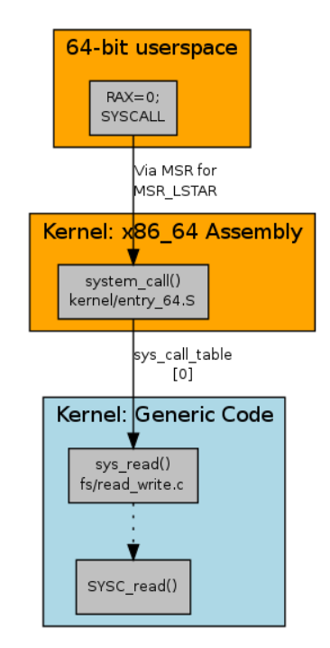

# System Calls
System calls are the method used by user space to interface with kernel space (ring 3 interfaces with ring 0) and in the context of linux each system call is identified by a unique number which is given as an arguement to the SYSCALL instruction in x86. Using the system call read as an example how this works in the C code for the linux kernel is that a macro "SYSCALL_DEFINE3(read, unsigned int, fd, char __user *, buf, size_t, count)" is used to define the system call read where 3 defines the amount of arguments the system call read takes, this expands to another macro "SYSCALL_DEFINEx(3, read, unsigned int, fd, char __user *, buf, size_t, count)" which puts 3 as an argument for the system call and then expands to 2 macros "SYSCALL_METADATA(sname, x, __VA_ARGS__) __SYSCALL_DEFINEx(x, sname, __VA_ARGS__)". The first macro SYSCALL_METADATA like said in the name just expands to metadata associated to the system call that can be used for tracing purposes, things like the typing and names of the parameters are some of the things this macro defines (this is only if the CONFIG_FTRACE_SYSCALLS macro is set on kernel compilation, else the SYSCALL_METADATA macro expands to nothing), while the __SYSCALL_DEFINEx macro expands to the actual definition of the system call, which looks as follows...

asmlinkage long sys_read(unsigned int fd, char __user * buf, size_t count)
    __attribute__((alias(__stringify(SyS_read))));

static inline long SYSC_read(unsigned int fd, char __user * buf, size_t count);
asmlinkage long SyS_read(long int fd, long int buf, long int count);

asmlinkage long SyS_read(long int fd, long int buf, long int count)
{
    long ret = SYSC_read((unsigned int) fd, (char __user *) buf, (size_t) count);
    asmlinkage_protect(3, ret, fd, buf, count);
    return ret;
}

static inline long SYSC_read(unsigned int fd, char __user * buf, size_t count)
{
    struct fd f = fdget_pos(fd);
    ssize_t ret = -EBADF;
    /* ... */

Where SYSC_read is the actual implementation of the system call, but is inaccessable outside of this translation unit and so a wrapper SyS_read is used to actually access this definition from the outside which is also aliased as sys_read above. Another thing to note are the asmlinkage keyword and the asmlinkage_protect() function call, the former is another compiler directive to inform the compiler that the function should expect it's arguments on the stack, while the later is a function prevents the compiler from safely reusing areas of the stack where what i assume the arguments that is given to it occupies. Inside of /linux/include/syscall.h there is another declaration of sys_read which can be used in the kernel to use the read system call aswell. Then in include/uapi/asm-generic/unistd.h numbers are assoicated with system calls and for the read system call the number 63 is associated to the sys_read function via the __SYSCALL(__NR_read, sys_read) macro which just expands to [63] = (sys_read) which can be used for array initializations. Though this is only used for some architectures, x86-64 instead uses a table in arch/x86/syscalls/syscall_64.tbl which associates the number 0 to read instead of 63 using this line...

0   common	read			sys_read

Which then the /arch/x86/syscalls/syscalltbl.sh script will use this file to generate a /x86/include/generated/asm/syscalls_64.h file which is used for the system call table. A common point for all architectures though is it seems system calls are all done via a system call table, though the ordering of system calls in this table seems to vary. Now we can get into the specifics for how system calls are entered from user space (atleast in x86-64). In userspace the SYSCALL instruction is invoked with the syscall number being specified in the RAX regiester, which then jumps to a function pointed to via the MSR_LSTAR register (this is setup on kernel startup by the syscall_init() function which used the wrmsrl to write to MSR_LSTAR which is a register for x86-64 specifically meant for system calls) which then calls the syscall entry point in kernel space called system_call(), this function will then dereference the system call table using value given in the RAX register, save the rest of the argument on the stack (remember the asmlinkage keyword) via the SAVE_ARGS macro, then jump to the function pointer in the system call table. From there sys_read() is executed and then SYSC_read() and this is how the read system call is implemented atleast in x86-64.

# Sources
- https://lwn.net/Articles/604287/
- https://lwn.net/Articles/604406/
- https://lwn.net/Articles/604515/

