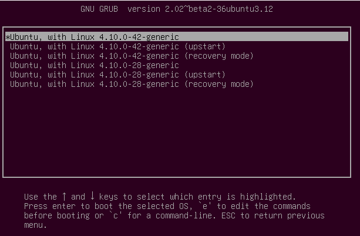

1. Boot starts by the cpu loading from ROM memory the UEFI or BIOS code
2. UEFI or BIOS code executes on the cpu first doing a hardware checks, this is called POST (Power On Self Test), if the computer POSTs then all the hardware is working, else a component is not working
3. UEFI or BIOS the executes code on the cpu to search the connected storage devices for the EFI storage partition (atleast if UEFI is used), this partition will contain the boot loader for your system which acts as a bridge from UEFI to your OS so the kernel can be loaded, this boot loader for linux is usually GRUB (the order for which storage devices are checked can also be configured in the BIOS or UEFI mode of your system)
4. UEFI or BIOS then loads GRUB into memory and tells the cpu to start running it, GRUB first checks all storage devices with EFI storage partitions for OS kernels to load and gives the user the choice for which OS kernel they would like to load like a main menu...

5. Once a kernel is chosen (or a timeout occurs which then the default kernel will be chosen) GRUB will the load the kernel into memory, and also loads a bunch of files and folders altogether called initramfs, initramfs creates a temporary file system that the kernel can use to load necessary drivers
6. The GRUB tells the cpu to start executing the kernel and now the job of the GRUB is finished (and presumingly unloaded from memory), the kernel then starts loading the necessary drivers in the temporary initramfs file system (this is necessary so it can communicate with physical devices), then starts searching these physical devices (the storage onces atleast) for the root file system and mounts it into memory and gets rid of initramfs from memory
7. The kernel then starts the init process in the root file system that it just mounted, this process then starts all the other necessary processes for your OS, things like the GUI (X server), the login/display manager, and others, init pretty much just starts everything
8. After init has finished doing the necessary tasks you will then be prompted to login by the login/display manager and that is how linux boots (: